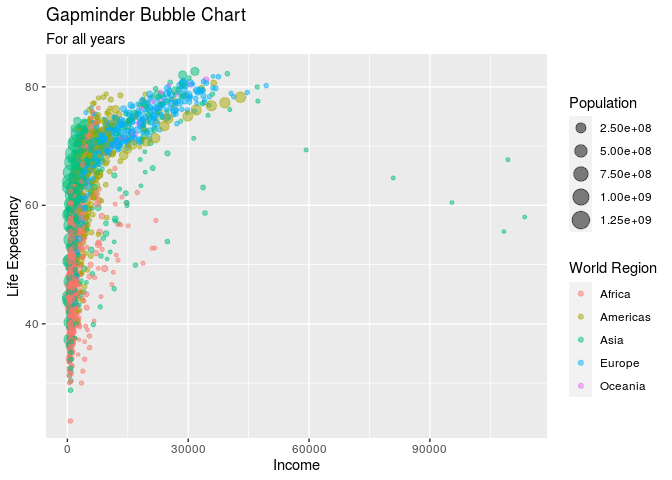
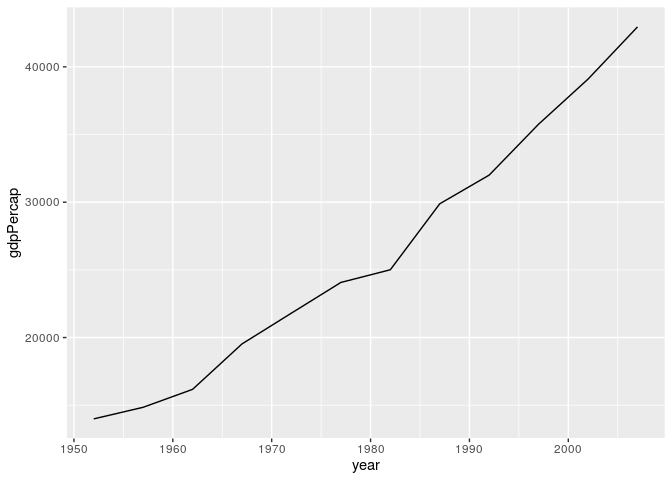
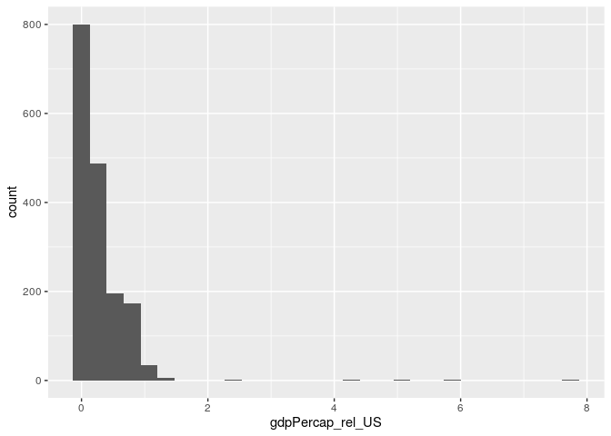

Recreating Gapminder
================

``` r
library(ggplot2)
library(dplyr)
```

    ## 
    ## Attaching package: 'dplyr'

    ## The following objects are masked from 'package:stats':
    ## 
    ##     filter, lag

    ## The following objects are masked from 'package:base':
    ## 
    ##     intersect, setdiff, setequal, union

``` r
library(gapminder)
```

## The Visualization

``` r
ggplot(data = gapminder) +
  geom_point(mapping = aes(x = gdpPercap, y = lifeExp, size = pop, color = continent), alpha = 0.5) +
  labs(x = "Income",
       y = "Life Expectancy",
       color = "World Region",
       size = "Population",
       title = "Gapminder Bubble Chart",
       subtitle = "For all years")
```

<!-- -->

## More with dplyr

### `filter()`, `select()`, and `arrange()`

``` r
gapminder
```

    ## # A tibble: 1,704 x 6
    ##    country     continent  year lifeExp      pop gdpPercap
    ##    <fct>       <fct>     <int>   <dbl>    <int>     <dbl>
    ##  1 Afghanistan Asia       1952    28.8  8425333      779.
    ##  2 Afghanistan Asia       1957    30.3  9240934      821.
    ##  3 Afghanistan Asia       1962    32.0 10267083      853.
    ##  4 Afghanistan Asia       1967    34.0 11537966      836.
    ##  5 Afghanistan Asia       1972    36.1 13079460      740.
    ##  6 Afghanistan Asia       1977    38.4 14880372      786.
    ##  7 Afghanistan Asia       1982    39.9 12881816      978.
    ##  8 Afghanistan Asia       1987    40.8 13867957      852.
    ##  9 Afghanistan Asia       1992    41.7 16317921      649.
    ## 10 Afghanistan Asia       1997    41.8 22227415      635.
    ## # … with 1,694 more rows

Create a copy of gapminder.

``` r
my_gm <- gapminder
my_gm
```

    ## # A tibble: 1,704 x 6
    ##    country     continent  year lifeExp      pop gdpPercap
    ##    <fct>       <fct>     <int>   <dbl>    <int>     <dbl>
    ##  1 Afghanistan Asia       1952    28.8  8425333      779.
    ##  2 Afghanistan Asia       1957    30.3  9240934      821.
    ##  3 Afghanistan Asia       1962    32.0 10267083      853.
    ##  4 Afghanistan Asia       1967    34.0 11537966      836.
    ##  5 Afghanistan Asia       1972    36.1 13079460      740.
    ##  6 Afghanistan Asia       1977    38.4 14880372      786.
    ##  7 Afghanistan Asia       1982    39.9 12881816      978.
    ##  8 Afghanistan Asia       1987    40.8 13867957      852.
    ##  9 Afghanistan Asia       1992    41.7 16317921      649.
    ## 10 Afghanistan Asia       1997    41.8 22227415      635.
    ## # … with 1,694 more rows

View only USA

``` r
my_gm %>% 
  filter(country == "United States")
```

    ## # A tibble: 12 x 6
    ##    country       continent  year lifeExp       pop gdpPercap
    ##    <fct>         <fct>     <int>   <dbl>     <int>     <dbl>
    ##  1 United States Americas   1952    68.4 157553000    13990.
    ##  2 United States Americas   1957    69.5 171984000    14847.
    ##  3 United States Americas   1962    70.2 186538000    16173.
    ##  4 United States Americas   1967    70.8 198712000    19530.
    ##  5 United States Americas   1972    71.3 209896000    21806.
    ##  6 United States Americas   1977    73.4 220239000    24073.
    ##  7 United States Americas   1982    74.6 232187835    25010.
    ##  8 United States Americas   1987    75.0 242803533    29884.
    ##  9 United States Americas   1992    76.1 256894189    32004.
    ## 10 United States Americas   1997    76.8 272911760    35767.
    ## 11 United States Americas   2002    77.3 287675526    39097.
    ## 12 United States Americas   2007    78.2 301139947    42952.

Plot `gdpPercap` over time (`year`) for only USA

``` r
my_gm %>% 
  filter(country == "United States") %>% 
  ggplot(aes(x = year, y = gdpPercap)) +
  geom_line()
```

<!-- -->

## May 12

Subset of gapminder with only USA

``` r
us_gm <- my_gm %>% 
  filter(country == "United States")
```

View only year, life expectancy, and gdp percap only for USA

``` r
us_gm %>% 
  select(year, lifeExp, gdpPercap) %>% 
  arrange(desc(lifeExp))
```

    ## # A tibble: 12 x 3
    ##     year lifeExp gdpPercap
    ##    <int>   <dbl>     <dbl>
    ##  1  2007    78.2    42952.
    ##  2  2002    77.3    39097.
    ##  3  1997    76.8    35767.
    ##  4  1992    76.1    32004.
    ##  5  1987    75.0    29884.
    ##  6  1982    74.6    25010.
    ##  7  1977    73.4    24073.
    ##  8  1972    71.3    21806.
    ##  9  1967    70.8    19530.
    ## 10  1962    70.2    16173.
    ## 11  1957    69.5    14847.
    ## 12  1952    68.4    13990.

Reorgaize US subset with life expectancy first and drop continent

``` r
us_gm %>% 
  select(lifeExp, everything(), -continent)
```

    ## # A tibble: 12 x 5
    ##    lifeExp country        year       pop gdpPercap
    ##      <dbl> <fct>         <int>     <int>     <dbl>
    ##  1    68.4 United States  1952 157553000    13990.
    ##  2    69.5 United States  1957 171984000    14847.
    ##  3    70.2 United States  1962 186538000    16173.
    ##  4    70.8 United States  1967 198712000    19530.
    ##  5    71.3 United States  1972 209896000    21806.
    ##  6    73.4 United States  1977 220239000    24073.
    ##  7    74.6 United States  1982 232187835    25010.
    ##  8    75.0 United States  1987 242803533    29884.
    ##  9    76.1 United States  1992 256894189    32004.
    ## 10    76.8 United States  1997 272911760    35767.
    ## 11    77.3 United States  2002 287675526    39097.
    ## 12    78.2 United States  2007 301139947    42952.

rename variables

``` r
us_gm %>% 
  select(life_exp = lifeExp, everything())
```

    ## # A tibble: 12 x 6
    ##    life_exp country       continent  year       pop gdpPercap
    ##       <dbl> <fct>         <fct>     <int>     <int>     <dbl>
    ##  1     68.4 United States Americas   1952 157553000    13990.
    ##  2     69.5 United States Americas   1957 171984000    14847.
    ##  3     70.2 United States Americas   1962 186538000    16173.
    ##  4     70.8 United States Americas   1967 198712000    19530.
    ##  5     71.3 United States Americas   1972 209896000    21806.
    ##  6     73.4 United States Americas   1977 220239000    24073.
    ##  7     74.6 United States Americas   1982 232187835    25010.
    ##  8     75.0 United States Americas   1987 242803533    29884.
    ##  9     76.1 United States Americas   1992 256894189    32004.
    ## 10     76.8 United States Americas   1997 272911760    35767.
    ## 11     77.3 United States Americas   2002 287675526    39097.
    ## 12     78.2 United States Americas   2007 301139947    42952.

Show the entries for Burundi after 1996 for only the variables `yr`,
`life_exp`, and `pop`.

``` r
my_gm %>% 
  filter(country == "Burundi" & year > 1996) %>% 
  select(yr = year, life_exp = lifeExp, pop)
```

    ## # A tibble: 3 x 3
    ##      yr life_exp     pop
    ##   <int>    <dbl>   <int>
    ## 1  1997     45.3 6121610
    ## 2  2002     47.4 7021078
    ## 3  2007     49.6 8390505

## May 14

Create `gdp` variable

``` r
my_gm %>% 
  mutate(gdp = gdpPercap * pop,
         gdp_billion = gdp / 1000000000)
```

    ## # A tibble: 1,704 x 8
    ##    country     continent  year lifeExp     pop gdpPercap         gdp gdp_billion
    ##    <fct>       <fct>     <int>   <dbl>   <int>     <dbl>       <dbl>       <dbl>
    ##  1 Afghanistan Asia       1952    28.8  8.43e6      779.     6.57e 9        6.57
    ##  2 Afghanistan Asia       1957    30.3  9.24e6      821.     7.59e 9        7.59
    ##  3 Afghanistan Asia       1962    32.0  1.03e7      853.     8.76e 9        8.76
    ##  4 Afghanistan Asia       1967    34.0  1.15e7      836.     9.65e 9        9.65
    ##  5 Afghanistan Asia       1972    36.1  1.31e7      740.     9.68e 9        9.68
    ##  6 Afghanistan Asia       1977    38.4  1.49e7      786.     1.17e10       11.7 
    ##  7 Afghanistan Asia       1982    39.9  1.29e7      978.     1.26e10       12.6 
    ##  8 Afghanistan Asia       1987    40.8  1.39e7      852.     1.18e10       11.8 
    ##  9 Afghanistan Asia       1992    41.7  1.63e7      649.     1.06e10       10.6 
    ## 10 Afghanistan Asia       1997    41.8  2.22e7      635.     1.41e10       14.1 
    ## # … with 1,694 more rows

``` r
my_gm %>% 
  mutate(gdp = gdpPercap * pop,
         gdp_billion = gdp / 1000000000,
         gdp = NULL)
```

    ## # A tibble: 1,704 x 7
    ##    country     continent  year lifeExp      pop gdpPercap gdp_billion
    ##    <fct>       <fct>     <int>   <dbl>    <int>     <dbl>       <dbl>
    ##  1 Afghanistan Asia       1952    28.8  8425333      779.        6.57
    ##  2 Afghanistan Asia       1957    30.3  9240934      821.        7.59
    ##  3 Afghanistan Asia       1962    32.0 10267083      853.        8.76
    ##  4 Afghanistan Asia       1967    34.0 11537966      836.        9.65
    ##  5 Afghanistan Asia       1972    36.1 13079460      740.        9.68
    ##  6 Afghanistan Asia       1977    38.4 14880372      786.       11.7 
    ##  7 Afghanistan Asia       1982    39.9 12881816      978.       12.6 
    ##  8 Afghanistan Asia       1987    40.8 13867957      852.       11.8 
    ##  9 Afghanistan Asia       1992    41.7 16317921      649.       10.6 
    ## 10 Afghanistan Asia       1997    41.8 22227415      635.       14.1 
    ## # … with 1,694 more rows

What does this code
do?

``` r
us_tib <-  my_gm %>%                                         # copy my_gm into us_tib object, then
  filter(country == "United States")                         # keep only the United States values
## This is a semi-dangerous way to do this variable
## I'd prefer to join on year, 
## but we haven't covered joins yet (but will next week!)
my_gm <-  my_gm %>%                                          # copy my_gm into my_gm object, then
  mutate(tmp = rep(us_tib$gdpPercap, nlevels(country)),      # create variable tmp, that is                                                                        repeating US gdpPercap for how many                                                                 countries there are
         gdpPercap_rel_US = gdpPercap / tmp,                # create variable var that is the ratio                                                                of gdpPercap for that country                                                                       compared to gdpPercap of US
         tmp = NULL)                                         # remove tmp variable
```

Is the US a high GDP country?

``` r
my_gm %>% 
  ggplot(aes(x = gdpPercap_rel_US)) +
  geom_histogram()
```

    ## `stat_bin()` using `bins = 30`. Pick better value with `binwidth`.

<!-- -->

| Function type        | Explanation                                                                                                    | Examples                            | In `dplyr`                                           |
| -------------------- | -------------------------------------------------------------------------------------------------------------- | ----------------------------------- | ---------------------------------------------------- |
| Vectorized functions | These take a vector, and operate on each component to return a vector of the same length (i.e., element-wise). | `cos`, `sin`, `log`, `exp`, `round` | `mutate`                                             |
| Aggregate functions  | These take a vector, and return a vector of length 1                                                           | `mean`, `sd`, `length`, `typeof`    | `summarize` - can be in combination with `group_by`. |
| Window functions     | these take a vector, and return a vector of the same length that depends on the vector as a whole.             | `lag`, `rank`, `cumsum`             | `mutate` in combination `group_by`                   |

Three ways to count in R (`dplyr`)

How many values/observations are in each continent?

``` r
my_gm %>% 
  group_by(continent) %>% 
  summarize(n = n())
```

    ## # A tibble: 5 x 2
    ##   continent     n
    ##   <fct>     <int>
    ## 1 Africa      624
    ## 2 Americas    300
    ## 3 Asia        396
    ## 4 Europe      360
    ## 5 Oceania      24

``` r
my_gm %>% 
  group_by(continent) %>% 
  tally()
```

    ## # A tibble: 5 x 2
    ##   continent     n
    ##   <fct>     <int>
    ## 1 Africa      624
    ## 2 Americas    300
    ## 3 Asia        396
    ## 4 Europe      360
    ## 5 Oceania      24

``` r
my_gm %>% 
  count(continent)
```

    ## # A tibble: 5 x 2
    ##   continent     n
    ##   <fct>     <int>
    ## 1 Africa      624
    ## 2 Americas    300
    ## 3 Asia        396
    ## 4 Europe      360
    ## 5 Oceania      24

``` r
my_gm %>% 
  group_by(continent) %>% 
  summarize(n = n(),
            n_countries = n_distinct(country))
```

    ## # A tibble: 5 x 3
    ##   continent     n n_countries
    ##   <fct>     <int>       <int>
    ## 1 Africa      624          52
    ## 2 Americas    300          25
    ## 3 Asia        396          33
    ## 4 Europe      360          30
    ## 5 Oceania      24           2

Compute summaries for multiple variables.

Compute the average and median `lifeExp` and `gdpPercap` by `continent`
and `year`, but only for 1952 and 2007.

``` r
my_gm %>% 
  filter(year %in% c(1952, 2007)) %>% 
  group_by(continent, year) %>% 
  summarize_at(vars(lifeExp, gdpPercap),
               list(mean = mean,
                    median = median))
```

    ## # A tibble: 10 x 6
    ## # Groups:   continent [5]
    ##    continent  year lifeExp_mean gdpPercap_mean lifeExp_median gdpPercap_median
    ##    <fct>     <int>        <dbl>          <dbl>          <dbl>            <dbl>
    ##  1 Africa     1952         39.1          1253.           38.8             987.
    ##  2 Africa     2007         54.8          3089.           52.9            1452.
    ##  3 Americas   1952         53.3          4079.           54.7            3048.
    ##  4 Americas   2007         73.6         11003.           72.9            8948.
    ##  5 Asia       1952         46.3          5195.           44.9            1207.
    ##  6 Asia       2007         70.7         12473.           72.4            4471.
    ##  7 Europe     1952         64.4          5661.           65.9            5142.
    ##  8 Europe     2007         77.6         25054.           78.6           28054.
    ##  9 Oceania    1952         69.3         10298.           69.3           10298.
    ## 10 Oceania    2007         80.7         29810.           80.7           29810.

versus no names in variables (not preferred):

``` r
my_gm %>% 
  filter(year %in% c(1952, 2007)) %>% 
  group_by(continent, year) %>% 
  summarize_at(vars(lifeExp, gdpPercap),
               list(mean, median))
```

    ## # A tibble: 10 x 6
    ## # Groups:   continent [5]
    ##    continent  year lifeExp_fn1 gdpPercap_fn1 lifeExp_fn2 gdpPercap_fn2
    ##    <fct>     <int>       <dbl>         <dbl>       <dbl>         <dbl>
    ##  1 Africa     1952        39.1         1253.        38.8          987.
    ##  2 Africa     2007        54.8         3089.        52.9         1452.
    ##  3 Americas   1952        53.3         4079.        54.7         3048.
    ##  4 Americas   2007        73.6        11003.        72.9         8948.
    ##  5 Asia       1952        46.3         5195.        44.9         1207.
    ##  6 Asia       2007        70.7        12473.        72.4         4471.
    ##  7 Europe     1952        64.4         5661.        65.9         5142.
    ##  8 Europe     2007        77.6        25054.        78.6        28054.
    ##  9 Oceania    1952        69.3        10298.        69.3        10298.
    ## 10 Oceania    2007        80.7        29810.        80.7        29810.

Grouped mutates View growth in population since first year of record by
each country

``` r
my_gm %>% 
  group_by(country) %>% 
  select(country, year, pop) %>% 
  mutate(pop_gain = pop - first(pop)) %>% 
  filter(year < 1963)
```

    ## # A tibble: 426 x 4
    ## # Groups:   country [142]
    ##    country      year      pop pop_gain
    ##    <fct>       <int>    <int>    <int>
    ##  1 Afghanistan  1952  8425333        0
    ##  2 Afghanistan  1957  9240934   815601
    ##  3 Afghanistan  1962 10267083  1841750
    ##  4 Albania      1952  1282697        0
    ##  5 Albania      1957  1476505   193808
    ##  6 Albania      1962  1728137   445440
    ##  7 Algeria      1952  9279525        0
    ##  8 Algeria      1957 10270856   991331
    ##  9 Algeria      1962 11000948  1721423
    ## 10 Angola       1952  4232095        0
    ## # … with 416 more rows

Calculate growth in life expectancy for each country compared to 1972
for each country.

``` r
my_gm %>% 
  group_by(country) %>% 
  select(country, year, lifeExp) %>% 
  mutate(life_exp_gain = lifeExp - nth(lifeExp, n = 5))
```

    ## # A tibble: 1,704 x 4
    ## # Groups:   country [142]
    ##    country      year lifeExp life_exp_gain
    ##    <fct>       <int>   <dbl>         <dbl>
    ##  1 Afghanistan  1952    28.8         -7.29
    ##  2 Afghanistan  1957    30.3         -5.76
    ##  3 Afghanistan  1962    32.0         -4.09
    ##  4 Afghanistan  1967    34.0         -2.07
    ##  5 Afghanistan  1972    36.1          0   
    ##  6 Afghanistan  1977    38.4          2.35
    ##  7 Afghanistan  1982    39.9          3.77
    ##  8 Afghanistan  1987    40.8          4.73
    ##  9 Afghanistan  1992    41.7          5.59
    ## 10 Afghanistan  1997    41.8          5.67
    ## # … with 1,694 more rows

``` r
my_gm %>%
  filter(continent == "Asia") %>%
  select(year, country, lifeExp) %>%
  group_by(year) %>%
  filter(min_rank(desc(lifeExp)) < 2 | min_rank(lifeExp) < 2) %>% 
  arrange(year) %>%
  print(n = Inf)
```

    ## # A tibble: 24 x 3
    ## # Groups:   year [12]
    ##     year country     lifeExp
    ##    <int> <fct>         <dbl>
    ##  1  1952 Afghanistan    28.8
    ##  2  1952 Israel         65.4
    ##  3  1957 Afghanistan    30.3
    ##  4  1957 Israel         67.8
    ##  5  1962 Afghanistan    32.0
    ##  6  1962 Israel         69.4
    ##  7  1967 Afghanistan    34.0
    ##  8  1967 Japan          71.4
    ##  9  1972 Afghanistan    36.1
    ## 10  1972 Japan          73.4
    ## 11  1977 Cambodia       31.2
    ## 12  1977 Japan          75.4
    ## 13  1982 Afghanistan    39.9
    ## 14  1982 Japan          77.1
    ## 15  1987 Afghanistan    40.8
    ## 16  1987 Japan          78.7
    ## 17  1992 Afghanistan    41.7
    ## 18  1992 Japan          79.4
    ## 19  1997 Afghanistan    41.8
    ## 20  1997 Japan          80.7
    ## 21  2002 Afghanistan    42.1
    ## 22  2002 Japan          82  
    ## 23  2007 Afghanistan    43.8
    ## 24  2007 Japan          82.6

Challenge: Which five countries had sharpest 5-year drop in lifeExp?

``` r
my_gm %>% 
  group_by(country) %>% 
  mutate(change_life_exp = lifeExp - lag(lifeExp, n = 1)) %>% 
  ungroup() %>% 
  top_n(n = 5, wt = change_life_exp) %>% 
  select(country, continent, year, change_life_exp) %>% 
  arrange(desc(change_life_exp))
```

    ## # A tibble: 5 x 4
    ##   country   continent  year change_life_exp
    ##   <fct>     <fct>     <int>           <dbl>
    ## 1 Cambodia  Asia       1982           19.7 
    ## 2 China     Asia       1967           13.9 
    ## 3 Rwanda    Africa     1997           12.5 
    ## 4 Rwanda    Africa     2002            7.33
    ## 5 Mauritius Africa     1957            7.10

What explains these drops in life expectancy? Post in community/Issue\!
