Recreating Gapminder
================

``` r
library(ggplot2)
library(dplyr)
library(tidyr)
library(forcats)
library(gapminder)
library(maps)
```

## The Visualization

``` r
ggplot(data = gapminder) +
  geom_point(mapping = aes(x = gdpPercap, y = lifeExp, 
                           size = pop, color = continent), alpha = 0.5) +
  labs(x = "Income", 
       y = "Life Expectancy", 
       color = "World Region", 
       size = "Population", 
       title = "Gapminder Bubble Chart", 
       subtitle = "For all years")
```

<!-- -->

## More with dplyr

### `filter()`, `select()`, and `arrange()`

``` r
gapminder
```

    ## # A tibble: 1,704 x 6
    ##    country     continent  year lifeExp      pop gdpPercap
    ##    <fct>       <fct>     <int>   <dbl>    <int>     <dbl>
    ##  1 Afghanistan Asia       1952    28.8  8425333      779.
    ##  2 Afghanistan Asia       1957    30.3  9240934      821.
    ##  3 Afghanistan Asia       1962    32.0 10267083      853.
    ##  4 Afghanistan Asia       1967    34.0 11537966      836.
    ##  5 Afghanistan Asia       1972    36.1 13079460      740.
    ##  6 Afghanistan Asia       1977    38.4 14880372      786.
    ##  7 Afghanistan Asia       1982    39.9 12881816      978.
    ##  8 Afghanistan Asia       1987    40.8 13867957      852.
    ##  9 Afghanistan Asia       1992    41.7 16317921      649.
    ## 10 Afghanistan Asia       1997    41.8 22227415      635.
    ## # … with 1,694 more rows

Create a copy of gapminder.

``` r
my_gm <- gapminder
my_gm
```

    ## # A tibble: 1,704 x 6
    ##    country     continent  year lifeExp      pop gdpPercap
    ##    <fct>       <fct>     <int>   <dbl>    <int>     <dbl>
    ##  1 Afghanistan Asia       1952    28.8  8425333      779.
    ##  2 Afghanistan Asia       1957    30.3  9240934      821.
    ##  3 Afghanistan Asia       1962    32.0 10267083      853.
    ##  4 Afghanistan Asia       1967    34.0 11537966      836.
    ##  5 Afghanistan Asia       1972    36.1 13079460      740.
    ##  6 Afghanistan Asia       1977    38.4 14880372      786.
    ##  7 Afghanistan Asia       1982    39.9 12881816      978.
    ##  8 Afghanistan Asia       1987    40.8 13867957      852.
    ##  9 Afghanistan Asia       1992    41.7 16317921      649.
    ## 10 Afghanistan Asia       1997    41.8 22227415      635.
    ## # … with 1,694 more rows

View only USA

``` r
my_gm %>% 
  filter(country == "United States")
```

    ## # A tibble: 12 x 6
    ##    country       continent  year lifeExp       pop gdpPercap
    ##    <fct>         <fct>     <int>   <dbl>     <int>     <dbl>
    ##  1 United States Americas   1952    68.4 157553000    13990.
    ##  2 United States Americas   1957    69.5 171984000    14847.
    ##  3 United States Americas   1962    70.2 186538000    16173.
    ##  4 United States Americas   1967    70.8 198712000    19530.
    ##  5 United States Americas   1972    71.3 209896000    21806.
    ##  6 United States Americas   1977    73.4 220239000    24073.
    ##  7 United States Americas   1982    74.6 232187835    25010.
    ##  8 United States Americas   1987    75.0 242803533    29884.
    ##  9 United States Americas   1992    76.1 256894189    32004.
    ## 10 United States Americas   1997    76.8 272911760    35767.
    ## 11 United States Americas   2002    77.3 287675526    39097.
    ## 12 United States Americas   2007    78.2 301139947    42952.

Plot `gdpPercap` over time (`year`) for only USA

``` r
my_gm %>% 
  filter(country == "United States") %>% 
  ggplot(aes(x = year, y = gdpPercap)) +
  geom_line()
```

<!-- -->

## May 12

Subset of gapminder with only USA

``` r
us_gm <- my_gm %>% 
  filter(country == "United States")
```

View only year, life expectancy, and gdp percap only for USA

``` r
us_gm %>% 
  select(year, lifeExp, gdpPercap) %>% 
  arrange(desc(lifeExp))
```

    ## # A tibble: 12 x 3
    ##     year lifeExp gdpPercap
    ##    <int>   <dbl>     <dbl>
    ##  1  2007    78.2    42952.
    ##  2  2002    77.3    39097.
    ##  3  1997    76.8    35767.
    ##  4  1992    76.1    32004.
    ##  5  1987    75.0    29884.
    ##  6  1982    74.6    25010.
    ##  7  1977    73.4    24073.
    ##  8  1972    71.3    21806.
    ##  9  1967    70.8    19530.
    ## 10  1962    70.2    16173.
    ## 11  1957    69.5    14847.
    ## 12  1952    68.4    13990.

Reorgaize US subset with life expectancy first and drop continent

``` r
us_gm %>% 
  select(lifeExp, everything(), -continent)
```

    ## # A tibble: 12 x 5
    ##    lifeExp country        year       pop gdpPercap
    ##      <dbl> <fct>         <int>     <int>     <dbl>
    ##  1    68.4 United States  1952 157553000    13990.
    ##  2    69.5 United States  1957 171984000    14847.
    ##  3    70.2 United States  1962 186538000    16173.
    ##  4    70.8 United States  1967 198712000    19530.
    ##  5    71.3 United States  1972 209896000    21806.
    ##  6    73.4 United States  1977 220239000    24073.
    ##  7    74.6 United States  1982 232187835    25010.
    ##  8    75.0 United States  1987 242803533    29884.
    ##  9    76.1 United States  1992 256894189    32004.
    ## 10    76.8 United States  1997 272911760    35767.
    ## 11    77.3 United States  2002 287675526    39097.
    ## 12    78.2 United States  2007 301139947    42952.

rename variables

``` r
us_gm %>% 
  select(life_exp = lifeExp, everything())
```

    ## # A tibble: 12 x 6
    ##    life_exp country       continent  year       pop gdpPercap
    ##       <dbl> <fct>         <fct>     <int>     <int>     <dbl>
    ##  1     68.4 United States Americas   1952 157553000    13990.
    ##  2     69.5 United States Americas   1957 171984000    14847.
    ##  3     70.2 United States Americas   1962 186538000    16173.
    ##  4     70.8 United States Americas   1967 198712000    19530.
    ##  5     71.3 United States Americas   1972 209896000    21806.
    ##  6     73.4 United States Americas   1977 220239000    24073.
    ##  7     74.6 United States Americas   1982 232187835    25010.
    ##  8     75.0 United States Americas   1987 242803533    29884.
    ##  9     76.1 United States Americas   1992 256894189    32004.
    ## 10     76.8 United States Americas   1997 272911760    35767.
    ## 11     77.3 United States Americas   2002 287675526    39097.
    ## 12     78.2 United States Americas   2007 301139947    42952.

Show the entries for Burundi after 1996 for only the variables `yr`,
`life_exp`, and `pop`.

``` r
my_gm %>% 
  filter(country == "Burundi" & year > 1996) %>% 
  select(yr = year, life_exp = lifeExp, pop)
```

    ## # A tibble: 3 x 3
    ##      yr life_exp     pop
    ##   <int>    <dbl>   <int>
    ## 1  1997     45.3 6121610
    ## 2  2002     47.4 7021078
    ## 3  2007     49.6 8390505

## May 14

Create `gdp` variable

``` r
my_gm %>% 
  mutate(gdp = gdpPercap * pop,
         gdp_billion = gdp / 1000000000)
```

    ## # A tibble: 1,704 x 8
    ##    country     continent  year lifeExp     pop gdpPercap         gdp gdp_billion
    ##    <fct>       <fct>     <int>   <dbl>   <int>     <dbl>       <dbl>       <dbl>
    ##  1 Afghanistan Asia       1952    28.8  8.43e6      779.     6.57e 9        6.57
    ##  2 Afghanistan Asia       1957    30.3  9.24e6      821.     7.59e 9        7.59
    ##  3 Afghanistan Asia       1962    32.0  1.03e7      853.     8.76e 9        8.76
    ##  4 Afghanistan Asia       1967    34.0  1.15e7      836.     9.65e 9        9.65
    ##  5 Afghanistan Asia       1972    36.1  1.31e7      740.     9.68e 9        9.68
    ##  6 Afghanistan Asia       1977    38.4  1.49e7      786.     1.17e10       11.7 
    ##  7 Afghanistan Asia       1982    39.9  1.29e7      978.     1.26e10       12.6 
    ##  8 Afghanistan Asia       1987    40.8  1.39e7      852.     1.18e10       11.8 
    ##  9 Afghanistan Asia       1992    41.7  1.63e7      649.     1.06e10       10.6 
    ## 10 Afghanistan Asia       1997    41.8  2.22e7      635.     1.41e10       14.1 
    ## # … with 1,694 more rows

``` r
my_gm %>% 
  mutate(gdp = gdpPercap * pop,
         gdp_billion = gdp / 1000000000,
         gdp = NULL)
```

    ## # A tibble: 1,704 x 7
    ##    country     continent  year lifeExp      pop gdpPercap gdp_billion
    ##    <fct>       <fct>     <int>   <dbl>    <int>     <dbl>       <dbl>
    ##  1 Afghanistan Asia       1952    28.8  8425333      779.        6.57
    ##  2 Afghanistan Asia       1957    30.3  9240934      821.        7.59
    ##  3 Afghanistan Asia       1962    32.0 10267083      853.        8.76
    ##  4 Afghanistan Asia       1967    34.0 11537966      836.        9.65
    ##  5 Afghanistan Asia       1972    36.1 13079460      740.        9.68
    ##  6 Afghanistan Asia       1977    38.4 14880372      786.       11.7 
    ##  7 Afghanistan Asia       1982    39.9 12881816      978.       12.6 
    ##  8 Afghanistan Asia       1987    40.8 13867957      852.       11.8 
    ##  9 Afghanistan Asia       1992    41.7 16317921      649.       10.6 
    ## 10 Afghanistan Asia       1997    41.8 22227415      635.       14.1 
    ## # … with 1,694 more rows

What does this code
do?

``` r
us_tib <-  my_gm %>%                                         # copy my_gm into us_tib object, then
  filter(country == "United States")                         # keep only the United States values
## This is a semi-dangerous way to do this variable
## I'd prefer to join on year, 
## but we haven't covered joins yet (but will next week!)
my_gm <-  my_gm %>%                                          # copy my_gm into my_gm object, then
  mutate(tmp = rep(us_tib$gdpPercap, nlevels(country)),      # create variable tmp, that is                                                                        repeating US gdpPercap for how many                                                                 countries there are
         gdpPercap_rel_US = gdpPercap / tmp,                # create variable var that is the ratio                                                                of gdpPercap for that country                                                                       compared to gdpPercap of US
         tmp = NULL)                                         # remove tmp variable
```

Is the US a high GDP country?

``` r
my_gm %>% 
  ggplot(aes(x = gdpPercap_rel_US)) +
  geom_histogram()
```

    ## `stat_bin()` using `bins = 30`. Pick better value with `binwidth`.

<!-- -->

| Function type        | Explanation                                                                                                    | Examples                            | In `dplyr`                                           |
| -------------------- | -------------------------------------------------------------------------------------------------------------- | ----------------------------------- | ---------------------------------------------------- |
| Vectorized functions | These take a vector, and operate on each component to return a vector of the same length (i.e., element-wise). | `cos`, `sin`, `log`, `exp`, `round` | `mutate`                                             |
| Aggregate functions  | These take a vector, and return a vector of length 1                                                           | `mean`, `sd`, `length`, `typeof`    | `summarize` - can be in combination with `group_by`. |
| Window functions     | these take a vector, and return a vector of the same length that depends on the vector as a whole.             | `lag`, `rank`, `cumsum`             | `mutate` in combination `group_by`                   |

Three ways to count in R (`dplyr`)

How many values/observations are in each continent?

``` r
my_gm %>% 
  group_by(continent) %>% 
  summarize(n = n())
```

    ## # A tibble: 5 x 2
    ##   continent     n
    ##   <fct>     <int>
    ## 1 Africa      624
    ## 2 Americas    300
    ## 3 Asia        396
    ## 4 Europe      360
    ## 5 Oceania      24

``` r
my_gm %>% 
  group_by(continent) %>% 
  tally()
```

    ## # A tibble: 5 x 2
    ##   continent     n
    ##   <fct>     <int>
    ## 1 Africa      624
    ## 2 Americas    300
    ## 3 Asia        396
    ## 4 Europe      360
    ## 5 Oceania      24

``` r
my_gm %>% 
  count(continent)
```

    ## # A tibble: 5 x 2
    ##   continent     n
    ##   <fct>     <int>
    ## 1 Africa      624
    ## 2 Americas    300
    ## 3 Asia        396
    ## 4 Europe      360
    ## 5 Oceania      24

``` r
my_gm %>% 
  group_by(continent) %>% 
  summarize(n = n(),
            n_countries = n_distinct(country))
```

    ## # A tibble: 5 x 3
    ##   continent     n n_countries
    ##   <fct>     <int>       <int>
    ## 1 Africa      624          52
    ## 2 Americas    300          25
    ## 3 Asia        396          33
    ## 4 Europe      360          30
    ## 5 Oceania      24           2

Compute summaries for multiple variables.

Compute the average and median `lifeExp` and `gdpPercap` by `continent`
and `year`, but only for 1952 and 2007.

``` r
my_gm %>% 
  filter(year %in% c(1952, 2007)) %>% 
  group_by(continent, year) %>% 
  summarize_at(vars(lifeExp, gdpPercap),
               list(mean = mean,
                    median = median))
```

    ## # A tibble: 10 x 6
    ## # Groups:   continent [5]
    ##    continent  year lifeExp_mean gdpPercap_mean lifeExp_median gdpPercap_median
    ##    <fct>     <int>        <dbl>          <dbl>          <dbl>            <dbl>
    ##  1 Africa     1952         39.1          1253.           38.8             987.
    ##  2 Africa     2007         54.8          3089.           52.9            1452.
    ##  3 Americas   1952         53.3          4079.           54.7            3048.
    ##  4 Americas   2007         73.6         11003.           72.9            8948.
    ##  5 Asia       1952         46.3          5195.           44.9            1207.
    ##  6 Asia       2007         70.7         12473.           72.4            4471.
    ##  7 Europe     1952         64.4          5661.           65.9            5142.
    ##  8 Europe     2007         77.6         25054.           78.6           28054.
    ##  9 Oceania    1952         69.3         10298.           69.3           10298.
    ## 10 Oceania    2007         80.7         29810.           80.7           29810.

versus no names in variables (not preferred):

``` r
my_gm %>% 
  filter(year %in% c(1952, 2007)) %>% 
  group_by(continent, year) %>% 
  summarize_at(vars(lifeExp, gdpPercap),
               list(mean, median))
```

    ## # A tibble: 10 x 6
    ## # Groups:   continent [5]
    ##    continent  year lifeExp_fn1 gdpPercap_fn1 lifeExp_fn2 gdpPercap_fn2
    ##    <fct>     <int>       <dbl>         <dbl>       <dbl>         <dbl>
    ##  1 Africa     1952        39.1         1253.        38.8          987.
    ##  2 Africa     2007        54.8         3089.        52.9         1452.
    ##  3 Americas   1952        53.3         4079.        54.7         3048.
    ##  4 Americas   2007        73.6        11003.        72.9         8948.
    ##  5 Asia       1952        46.3         5195.        44.9         1207.
    ##  6 Asia       2007        70.7        12473.        72.4         4471.
    ##  7 Europe     1952        64.4         5661.        65.9         5142.
    ##  8 Europe     2007        77.6        25054.        78.6        28054.
    ##  9 Oceania    1952        69.3        10298.        69.3        10298.
    ## 10 Oceania    2007        80.7        29810.        80.7        29810.

Grouped mutates View growth in population since first year of record by
each country

``` r
my_gm %>% 
  group_by(country) %>% 
  select(country, year, pop) %>% 
  mutate(pop_gain = pop - first(pop)) %>% 
  filter(year < 1963)
```

    ## # A tibble: 426 x 4
    ## # Groups:   country [142]
    ##    country      year      pop pop_gain
    ##    <fct>       <int>    <int>    <int>
    ##  1 Afghanistan  1952  8425333        0
    ##  2 Afghanistan  1957  9240934   815601
    ##  3 Afghanistan  1962 10267083  1841750
    ##  4 Albania      1952  1282697        0
    ##  5 Albania      1957  1476505   193808
    ##  6 Albania      1962  1728137   445440
    ##  7 Algeria      1952  9279525        0
    ##  8 Algeria      1957 10270856   991331
    ##  9 Algeria      1962 11000948  1721423
    ## 10 Angola       1952  4232095        0
    ## # … with 416 more rows

Calculate growth in life expectancy for each country compared to 1972
for each country.

``` r
my_gm %>% 
  group_by(country) %>% 
  select(country, year, lifeExp) %>% 
  mutate(life_exp_gain = lifeExp - nth(lifeExp, n = 5))
```

    ## # A tibble: 1,704 x 4
    ## # Groups:   country [142]
    ##    country      year lifeExp life_exp_gain
    ##    <fct>       <int>   <dbl>         <dbl>
    ##  1 Afghanistan  1952    28.8         -7.29
    ##  2 Afghanistan  1957    30.3         -5.76
    ##  3 Afghanistan  1962    32.0         -4.09
    ##  4 Afghanistan  1967    34.0         -2.07
    ##  5 Afghanistan  1972    36.1          0   
    ##  6 Afghanistan  1977    38.4          2.35
    ##  7 Afghanistan  1982    39.9          3.77
    ##  8 Afghanistan  1987    40.8          4.73
    ##  9 Afghanistan  1992    41.7          5.59
    ## 10 Afghanistan  1997    41.8          5.67
    ## # … with 1,694 more rows

``` r
my_gm %>%
  filter(continent == "Asia") %>%
  select(year, country, lifeExp) %>%
  group_by(year) %>%
  filter(min_rank(desc(lifeExp)) < 2 | min_rank(lifeExp) < 2) %>% 
  arrange(year) %>%
  print(n = Inf)
```

    ## # A tibble: 24 x 3
    ## # Groups:   year [12]
    ##     year country     lifeExp
    ##    <int> <fct>         <dbl>
    ##  1  1952 Afghanistan    28.8
    ##  2  1952 Israel         65.4
    ##  3  1957 Afghanistan    30.3
    ##  4  1957 Israel         67.8
    ##  5  1962 Afghanistan    32.0
    ##  6  1962 Israel         69.4
    ##  7  1967 Afghanistan    34.0
    ##  8  1967 Japan          71.4
    ##  9  1972 Afghanistan    36.1
    ## 10  1972 Japan          73.4
    ## 11  1977 Cambodia       31.2
    ## 12  1977 Japan          75.4
    ## 13  1982 Afghanistan    39.9
    ## 14  1982 Japan          77.1
    ## 15  1987 Afghanistan    40.8
    ## 16  1987 Japan          78.7
    ## 17  1992 Afghanistan    41.7
    ## 18  1992 Japan          79.4
    ## 19  1997 Afghanistan    41.8
    ## 20  1997 Japan          80.7
    ## 21  2002 Afghanistan    42.1
    ## 22  2002 Japan          82  
    ## 23  2007 Afghanistan    43.8
    ## 24  2007 Japan          82.6

Challenge: Which five countries had sharpest 5-year drop in lifeExp?

``` r
my_gm %>% 
  group_by(country) %>% 
  mutate(change_life_exp = lifeExp - lag(lifeExp, n = 1)) %>% 
  ungroup() %>% 
  top_n(n = 5, wt = change_life_exp) %>% 
  select(country, continent, year, change_life_exp) %>% 
  arrange(desc(change_life_exp))
```

    ## # A tibble: 5 x 4
    ##   country   continent  year change_life_exp
    ##   <fct>     <fct>     <int>           <dbl>
    ## 1 Cambodia  Asia       1982           19.7 
    ## 2 China     Asia       1967           13.9 
    ## 3 Rwanda    Africa     1997           12.5 
    ## 4 Rwanda    Africa     2002            7.33
    ## 5 Mauritius Africa     1957            7.10

What explains these drops in life expectancy? Post in community/Issue\!

### May 21 Session

``` r
gm_long <- gapminder %>% 
  pivot_longer(lifeExp:gdpPercap,
               names_to = "measure",
               values_to = "amount")
gm_long
```

    ## # A tibble: 5,112 x 5
    ##    country     continent  year measure       amount
    ##    <fct>       <fct>     <int> <chr>          <dbl>
    ##  1 Afghanistan Asia       1952 lifeExp         28.8
    ##  2 Afghanistan Asia       1952 pop        8425333  
    ##  3 Afghanistan Asia       1952 gdpPercap      779. 
    ##  4 Afghanistan Asia       1957 lifeExp         30.3
    ##  5 Afghanistan Asia       1957 pop        9240934  
    ##  6 Afghanistan Asia       1957 gdpPercap      821. 
    ##  7 Afghanistan Asia       1962 lifeExp         32.0
    ##  8 Afghanistan Asia       1962 pop       10267083  
    ##  9 Afghanistan Asia       1962 gdpPercap      853. 
    ## 10 Afghanistan Asia       1967 lifeExp         34.0
    ## # … with 5,102 more rows

``` r
gm_wide <- gapminder %>% 
  pivot_wider(names_from = year,
              values_from = c(lifeExp, pop, gdpPercap))
gm_wide
```

    ## # A tibble: 142 x 38
    ##    country continent lifeExp_1952 lifeExp_1957 lifeExp_1962 lifeExp_1967
    ##    <fct>   <fct>            <dbl>        <dbl>        <dbl>        <dbl>
    ##  1 Afghan… Asia              28.8         30.3         32.0         34.0
    ##  2 Albania Europe            55.2         59.3         64.8         66.2
    ##  3 Algeria Africa            43.1         45.7         48.3         51.4
    ##  4 Angola  Africa            30.0         32.0         34           36.0
    ##  5 Argent… Americas          62.5         64.4         65.1         65.6
    ##  6 Austra… Oceania           69.1         70.3         70.9         71.1
    ##  7 Austria Europe            66.8         67.5         69.5         70.1
    ##  8 Bahrain Asia              50.9         53.8         56.9         59.9
    ##  9 Bangla… Asia              37.5         39.3         41.2         43.5
    ## 10 Belgium Europe            68           69.2         70.2         70.9
    ## # … with 132 more rows, and 32 more variables: lifeExp_1972 <dbl>,
    ## #   lifeExp_1977 <dbl>, lifeExp_1982 <dbl>, lifeExp_1987 <dbl>,
    ## #   lifeExp_1992 <dbl>, lifeExp_1997 <dbl>, lifeExp_2002 <dbl>,
    ## #   lifeExp_2007 <dbl>, pop_1952 <int>, pop_1957 <int>, pop_1962 <int>,
    ## #   pop_1967 <int>, pop_1972 <int>, pop_1977 <int>, pop_1982 <int>,
    ## #   pop_1987 <int>, pop_1992 <int>, pop_1997 <int>, pop_2002 <int>,
    ## #   pop_2007 <int>, gdpPercap_1952 <dbl>, gdpPercap_1957 <dbl>,
    ## #   gdpPercap_1962 <dbl>, gdpPercap_1967 <dbl>, gdpPercap_1972 <dbl>,
    ## #   gdpPercap_1977 <dbl>, gdpPercap_1982 <dbl>, gdpPercap_1987 <dbl>,
    ## #   gdpPercap_1992 <dbl>, gdpPercap_1997 <dbl>, gdpPercap_2002 <dbl>,
    ## #   gdpPercap_2007 <dbl>

### wide to long with only gdp

Using `pivot_longer()` and `separate()`.

``` r
gm_wide %>%
  select(country, continent, starts_with("gdp")) %>%
  pivot_longer(starts_with("gdp"),
               names_to = "year",
               values_to = "gdppercap") %>%
  separate(year, into = c(NA, "year"), sep = "_")
```

    ## # A tibble: 1,704 x 4
    ##    country     continent year  gdppercap
    ##    <fct>       <fct>     <chr>     <dbl>
    ##  1 Afghanistan Asia      1952       779.
    ##  2 Afghanistan Asia      1957       821.
    ##  3 Afghanistan Asia      1962       853.
    ##  4 Afghanistan Asia      1967       836.
    ##  5 Afghanistan Asia      1972       740.
    ##  6 Afghanistan Asia      1977       786.
    ##  7 Afghanistan Asia      1982       978.
    ##  8 Afghanistan Asia      1987       852.
    ##  9 Afghanistan Asia      1992       649.
    ## 10 Afghanistan Asia      1997       635.
    ## # … with 1,694 more rows

Using `pivot_longer()` and `names_sep = ...`

``` r
gm_wide %>% 
  select(country, continent, starts_with("gdp")) %>%
  pivot_longer(starts_with("gdp"),
               names_to = c(NA, "year"),
               values_to = "gdpPercap",
               names_sep = 10)
```

    ## # A tibble: 1,704 x 4
    ##    country     continent year  gdpPercap
    ##    <fct>       <fct>     <chr>     <dbl>
    ##  1 Afghanistan Asia      1952       779.
    ##  2 Afghanistan Asia      1957       821.
    ##  3 Afghanistan Asia      1962       853.
    ##  4 Afghanistan Asia      1967       836.
    ##  5 Afghanistan Asia      1972       740.
    ##  6 Afghanistan Asia      1977       786.
    ##  7 Afghanistan Asia      1982       978.
    ##  8 Afghanistan Asia      1987       852.
    ##  9 Afghanistan Asia      1992       649.
    ## 10 Afghanistan Asia      1997       635.
    ## # … with 1,694 more rows

Using `pivot_longer()` and `names_pattern = "..."`

``` r
gm_wide %>% 
  select(country, continent, starts_with("gdp")) %>% 
  pivot_longer(starts_with("gdp"),
               names_to = "year",
               values_to = "gdpPercap",
               names_pattern = "gdpPercap_(.*)")
```

    ## # A tibble: 1,704 x 4
    ##    country     continent year  gdpPercap
    ##    <fct>       <fct>     <chr>     <dbl>
    ##  1 Afghanistan Asia      1952       779.
    ##  2 Afghanistan Asia      1957       821.
    ##  3 Afghanistan Asia      1962       853.
    ##  4 Afghanistan Asia      1967       836.
    ##  5 Afghanistan Asia      1972       740.
    ##  6 Afghanistan Asia      1977       786.
    ##  7 Afghanistan Asia      1982       978.
    ##  8 Afghanistan Asia      1987       852.
    ##  9 Afghanistan Asia      1992       649.
    ## 10 Afghanistan Asia      1997       635.
    ## # … with 1,694 more rows

### long to wide

``` r
gm_long %>% 
  pivot_wider(names_from = c(year, measure),
              values_from = amount,
              names_prefix = "silly_")
```

    ## # A tibble: 142 x 38
    ##    country continent silly_1952_life… silly_1952_pop silly_1952_gdpP…
    ##    <fct>   <fct>                <dbl>          <dbl>            <dbl>
    ##  1 Afghan… Asia                  28.8        8425333             779.
    ##  2 Albania Europe                55.2        1282697            1601.
    ##  3 Algeria Africa                43.1        9279525            2449.
    ##  4 Angola  Africa                30.0        4232095            3521.
    ##  5 Argent… Americas              62.5       17876956            5911.
    ##  6 Austra… Oceania               69.1        8691212           10040.
    ##  7 Austria Europe                66.8        6927772            6137.
    ##  8 Bahrain Asia                  50.9         120447            9867.
    ##  9 Bangla… Asia                  37.5       46886859             684.
    ## 10 Belgium Europe                68          8730405            8343.
    ## # … with 132 more rows, and 33 more variables: silly_1957_lifeExp <dbl>,
    ## #   silly_1957_pop <dbl>, silly_1957_gdpPercap <dbl>, silly_1962_lifeExp <dbl>,
    ## #   silly_1962_pop <dbl>, silly_1962_gdpPercap <dbl>, silly_1967_lifeExp <dbl>,
    ## #   silly_1967_pop <dbl>, silly_1967_gdpPercap <dbl>, silly_1972_lifeExp <dbl>,
    ## #   silly_1972_pop <dbl>, silly_1972_gdpPercap <dbl>, silly_1977_lifeExp <dbl>,
    ## #   silly_1977_pop <dbl>, silly_1977_gdpPercap <dbl>, silly_1982_lifeExp <dbl>,
    ## #   silly_1982_pop <dbl>, silly_1982_gdpPercap <dbl>, silly_1987_lifeExp <dbl>,
    ## #   silly_1987_pop <dbl>, silly_1987_gdpPercap <dbl>, silly_1992_lifeExp <dbl>,
    ## #   silly_1992_pop <dbl>, silly_1992_gdpPercap <dbl>, silly_1997_lifeExp <dbl>,
    ## #   silly_1997_pop <dbl>, silly_1997_gdpPercap <dbl>, silly_2002_lifeExp <dbl>,
    ## #   silly_2002_pop <dbl>, silly_2002_gdpPercap <dbl>, silly_2007_lifeExp <dbl>,
    ## #   silly_2007_pop <dbl>, silly_2007_gdpPercap <dbl>

Some text examples:

silly-1952-lifeExp - nope (double-clicking is awkward)
silly:1952:lifeExp - nope (double-clicking is awkward)
silly\_1952\_lifeExp - preferred

## May 28

Coloring a map of the world

``` r
ggplot(map_data("world"), aes(x = long, y = lat)) +
  geom_polygon(aes(group = group))
```

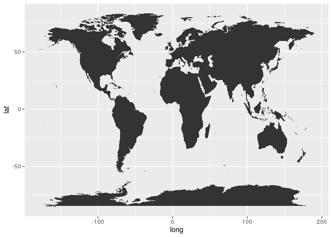<!-- -->

``` r
# ggplot(map_data("world2"), aes(x = long, y = lat)) +
#   geom_polygon(aes(group = group))
```

Adding color

``` r
ggplot(map_data("world"), aes(x = long, y = lat)) +
  geom_polygon(aes(group = group, fill = group))
```

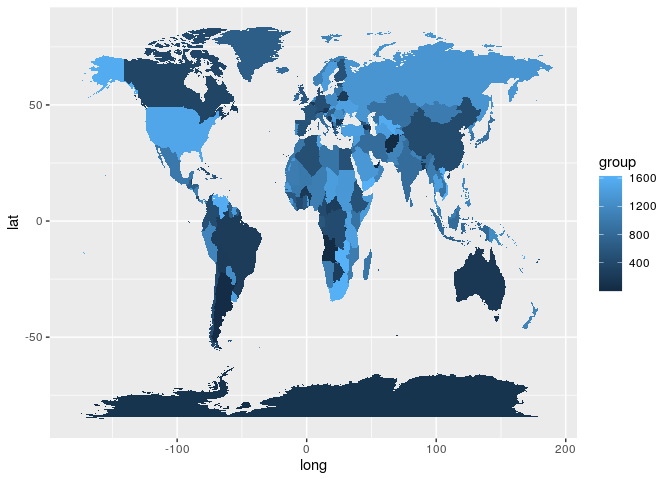<!-- -->

Combining shape file with continent information

``` r
world_shapes <- map_data("world") %>% as_tibble()

world_continent <- world_shapes %>% 
  left_join(gapminder %>% select(country, continent),
            by = c("region" = "country"))
```

    ## Warning: Column `region`/`country` joining character vector and factor, coercing
    ## into character vector

Plot world, color by continent

``` r
ggplot(world_continent, aes(x = long, y = lat)) +
  geom_polygon(aes(group = group, fill = continent))
```

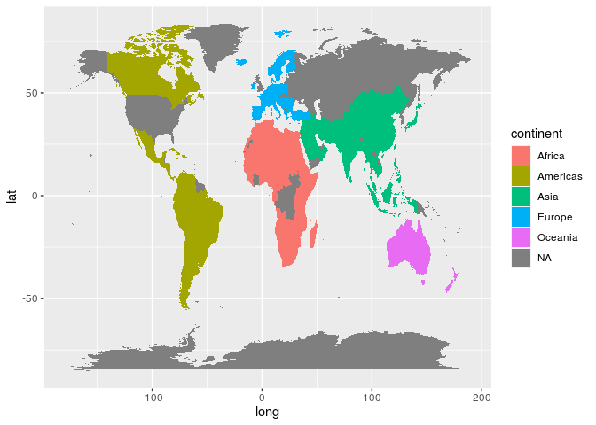<!-- -->

``` r
world_continent %>% 
  filter(is.na(continent)) %>% 
  count(continent)
```

    ## Warning: Factor `continent` contains implicit NA, consider using
    ## `forcats::fct_explicit_na`

    ## # A tibble: 1 x 2
    ##   continent     n
    ##   <fct>     <int>
    ## 1 <NA>      34665

``` r
anti_join(gapminder %>% select(country, continent),
          world_shapes %>% select(region),
          by = c("country" = "region")) %>% 
  count(country)
```

    ## Warning: Column `country`/`region` joining factor and character vector, coercing
    ## into character vector

    ## # A tibble: 12 x 2
    ##    country                 n
    ##    <fct>               <int>
    ##  1 Congo, Dem. Rep.       12
    ##  2 Congo, Rep.            12
    ##  3 Cote d'Ivoire          12
    ##  4 Hong Kong, China       12
    ##  5 Korea, Dem. Rep.       12
    ##  6 Korea, Rep.            12
    ##  7 Slovak Republic        12
    ##  8 Trinidad and Tobago    12
    ##  9 United Kingdom         12
    ## 10 United States          12
    ## 11 West Bank and Gaza     12
    ## 12 Yemen, Rep.            12

``` r
anti_join(world_shapes %>% select(region),
          gapminder %>% select(country, continent),
          by = c("region" = "country")) %>% 
  count(region)
```

    ## Warning: Column `region`/`country` joining character vector and factor, coercing
    ## into character vector

    ## # A tibble: 122 x 2
    ##    region               n
    ##    <chr>            <int>
    ##  1 American Samoa       8
    ##  2 Andorra             19
    ##  3 Anguilla             6
    ##  4 Antarctica        4658
    ##  5 Antigua             12
    ##  6 Armenia            146
    ##  7 Aruba               10
    ##  8 Ascension Island    11
    ##  9 Azerbaijan         264
    ## 10 Azores              67
    ## # … with 112 more rows

Relabel gapminder countries

``` r
gm_region <- gapminder %>% 
  mutate(
    country = as.character(country),
    region = case_when(
      country == "Congo, Dem. Rep." ~ "Democratic Republic of the Congo",
      country == "Congo, Rep." ~ "Republic of Congo",
      country == "Cote d'Ivoire" ~ "Ivory Coast",
      country == "Korea, Dem. Rep." ~ "North Korea",
      country == "Korea, Rep." ~ "South Korea",
      country == "Slovak Republic" ~ "Slovakia",
      country == "Trinidad and Tobago" ~ "Trinidad",
      country == "United Kingdom" ~ "UK",
      country == "United States" ~ "USA",
      country == "West Bank and Gaza" ~ "Palestine",
      country == "Yemen, Rep." ~ "Yemen",
      TRUE ~ country
  ))
```

Join relabeled values to shape file

``` r
world_continent <- left_join(world_shapes,
                             gm_region,
                             by = "region")
```

Map relabeled continents

``` r
ggplot(world_continent, aes(x = long, y = lat)) +
  geom_polygon(aes(group = group, fill = continent))
```

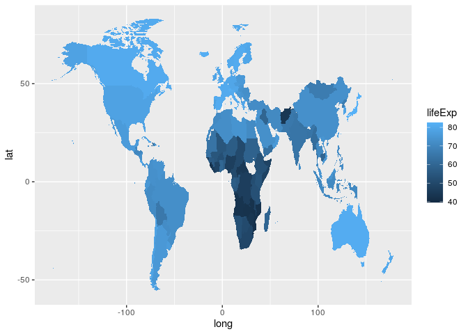<!-- -->

Life expectancy in 2007 across the globe

``` r
world_continent %>% 
  filter(year == 2007) %>% 
  ggplot(aes(x = long, y = lat)) +
  geom_polygon(aes(group = group, fill = lifeExp))
```

<!-- -->

gdpPercap in 2007 across the globe

``` r
world_continent %>% 
  filter(year == 2007) %>% 
  ggplot(aes(x = long, y = lat)) +
  geom_polygon(aes(group = group, fill = gdpPercap))
```

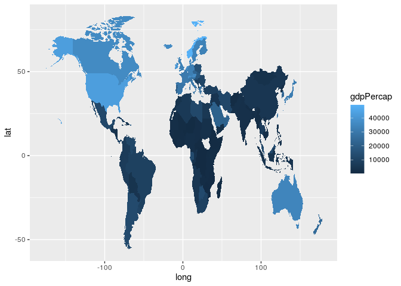<!-- -->

## June 2

Factors

``` r
str(gapminder$continent)
```

    ##  Factor w/ 5 levels "Africa","Americas",..: 3 3 3 3 3 3 3 3 3 3 ...

``` r
levels(gapminder$continent)
```

    ## [1] "Africa"   "Americas" "Asia"     "Europe"   "Oceania"

``` r
nlevels(gapminder$continent)
```

    ## [1] 5

``` r
class(gapminder$continent)
```

    ## [1] "factor"

``` r
gapminder %>% 
  count(continent)
```

    ## # A tibble: 5 x 2
    ##   continent     n
    ##   <fct>     <int>
    ## 1 Africa      624
    ## 2 Americas    300
    ## 3 Asia        396
    ## 4 Europe      360
    ## 5 Oceania      24

### Unused factors

``` r
nlevels(gapminder$country)
```

    ## [1] 142

``` r
set.seed(123)
samp_countries <- sample(unique(gapminder$country), size = 7)

samp_gm <- gapminder %>% 
  filter(country %in% samp_countries)

nlevels(samp_gm$country)
```

    ## [1] 142

``` r
samp_gm_drop <- samp_gm %>% 
  droplevels()

nlevels(samp_gm_drop$country)
```

    ## [1] 7

### Change factor ordering

By default, countries/continent are ordered alphabetically

``` r
gapminder %>% 
  ggplot(aes(y = continent)) +
  geom_bar()
```

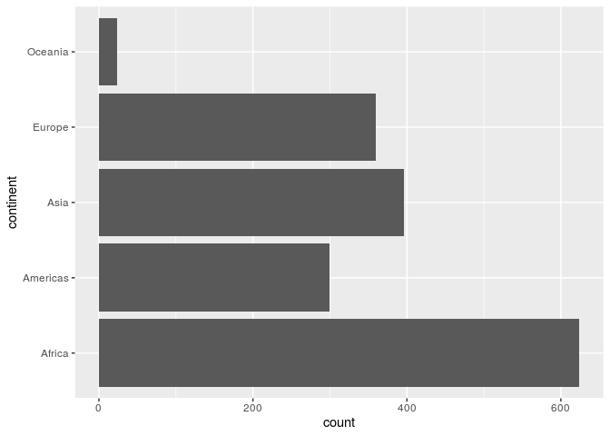<!-- -->

#### By frequency

``` r
gapminder %>% 
  mutate(continent = fct_infreq(continent)) %>% 
  ggplot(aes(y = continent)) +
  geom_bar()
```

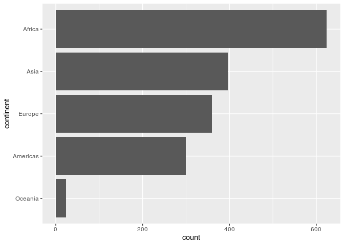<!-- -->

``` r
gapminder %>% 
  ggplot(aes(y = fct_infreq(continent))) +
  geom_bar() +
  labs(y = "continent")
```

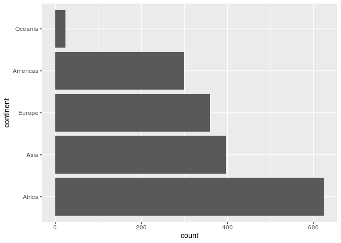<!-- -->

#### By reverse freq

``` r
gapminder %>% 
  mutate(continent = fct_infreq(continent),
         continent = fct_rev(continent)) %>% 
  ggplot(aes(y = continent)) +
  geom_bar()
```

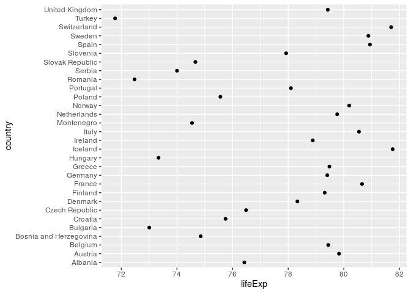<!-- -->

#### By another variable

Plot European countries ordered by lifeExp

``` r
gm_europe_2007 <- gapminder %>% 
  filter(year == 2007, continent == "Europe")

gm_europe_2007 %>% 
  ggplot(aes(x = lifeExp, y = country)) +
  geom_point()
```

<!-- -->

``` r
gm_europe_2007 %>% 
  ggplot(aes(x = lifeExp, y = fct_reorder(country, lifeExp))) +
  geom_point() +
  labs(y = "country")
```

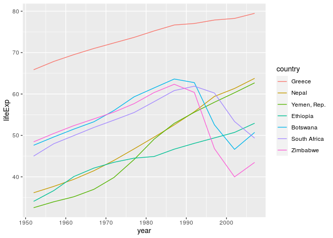<!-- -->

#### By two variables

``` r
samp_gm %>% 
  ggplot(aes(x = year, y = lifeExp, color = country)) +
  geom_line()
```

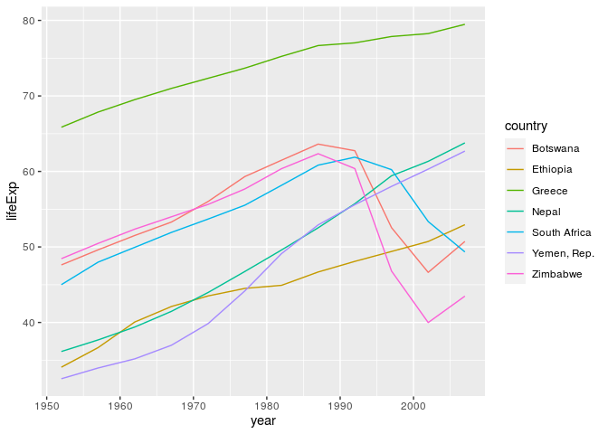<!-- -->

``` r
samp_gm %>% 
  ggplot(aes(x = year, y = lifeExp,
                  color = fct_reorder2(country, year, lifeExp))) +
  geom_line() +
  labs(color = "country") # to make better looking label
```

<!-- -->

### Recoding levels

``` r
nlevels(gapminder$country)
```

    ## [1] 142

``` r
three_gm <- gapminder %>% 
  filter(country %in% c("United States", "Greece", "Australia")) %>% 
  droplevels()

nlevels(three_gm$country)
```

    ## [1] 3

``` r
three_gm$country %>% levels()
```

    ## [1] "Australia"     "Greece"        "United States"

``` r
three_gm$country %>% 
  fct_recode("US" = "United States", "Oz" = "Australia") %>% 
  levels()
```

    ## [1] "Oz"     "Greece" "US"

``` r
three_gm2 <- three_gm %>% 
  mutate(country = fct_recode(country, "US" = "United States", "Oz" = "Australia"))
```

### Combining factors

``` r
gm1 <- gapminder %>% 
  filter(country %in% c("United States", "Mexico"), year > 2000) %>% 
  droplevels()

gm2 <- gapminder %>% 
  filter(country %in% c("France", "Germany"), year > 2000) %>% 
  droplevels()

levels(gm1$country)
```

    ## [1] "Mexico"        "United States"

``` r
levels(gm2$country)
```

    ## [1] "France"  "Germany"

Can we simply combine these
    datasets?

``` r
c(gm1$country,gm2$country)
```

    ## [1] 1 1 2 2 1 1 2 2

``` r
fct_c(gm1$country,gm2$country)
```

    ## [1] Mexico        Mexico        United States United States France       
    ## [6] France        Germany       Germany      
    ## Levels: Mexico United States France Germany
